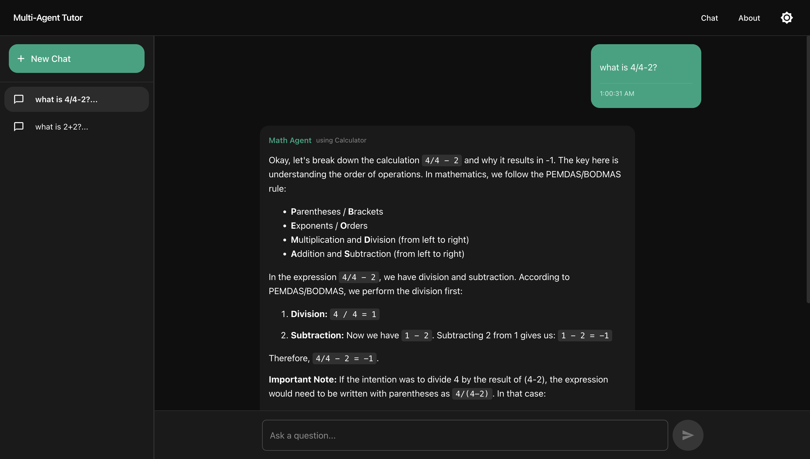
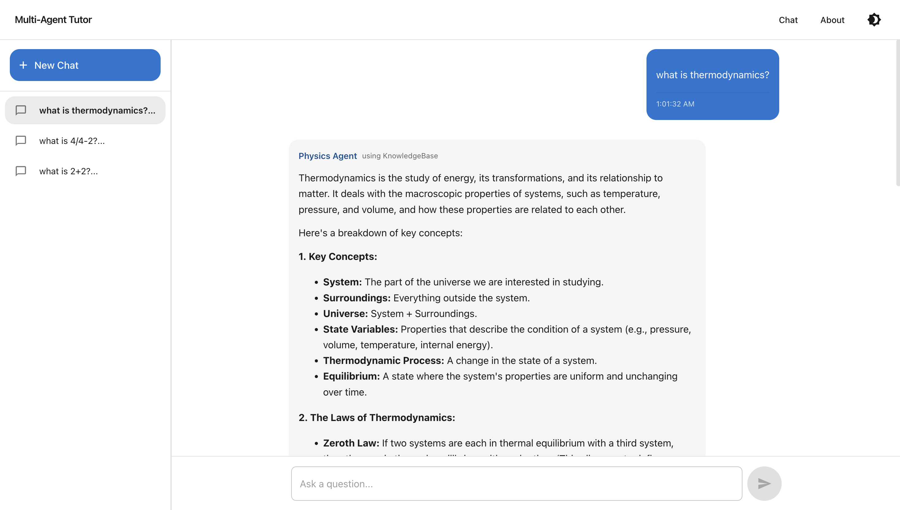

# Tutor Agent: Multi-Agent AI Tutoring System

## Table of Contents

1. [Project Overview](#project-overview)
2. [Live Demo](#live-demo)
3. [Screenshot](#screenshot)
4. [Key Features](#key-features)
5. [Architecture](#architecture)
6. [Directory Structure & Index](#directory-structure--index)
7. [Setup & Installation](#setup--installation)
8. [Configuration & Environment](#configuration--environment)
9. [Usage Guide](#usage-guide)
10. [Development Playbook](#development-playbook)
11. [Deployment](#deployment)
12. [Best Practices](#best-practices)
13. [Contributing](#contributing)
14. [FAQ](#faq)
15. [Challenges & Solutions](#challenges--solutions)
16. [References & Further Reading](#references--further-reading)

---

## Project Overview

**Tutor Agent** is an AI-powered educational assistant that leverages a multi-agent along with multi turn architecture to provide specialized tutoring in mathematics and physics (with extensibility for more domains). It uses Google's Gemini API for LLM-powered reasoning, and routes student queries to the most appropriate specialist agent, which can use tools like calculators and knowledge bases to generate comprehensive, step-by-step answers.

---

## Key Features


### Smart Routing

- Automatic subject detection
- Context-aware agent selection
- Seamless agent switching when needed
- Multi-agent collaboration for complex queries

### Specialist Agents

- Math Agent for mathematical problems
- Physics Agent for physics concepts
- Extensible architecture for new domains
- Tool-equipped agents for specialized tasks

### Multi-Turn Conversations

- Maintains context across multiple interactions
- Builds on previous questions and answers
- Allows follow-up questions and clarifications
- Persistent conversation history with MongoDB

### Rate Limiting

- Protects API endpoints from abuse
- Configurable limits per user/IP
- Redis-based rate limiting implementation
- Graceful handling of limit exceeded cases

### Caching with Redis

- Fast response caching for rate limit
- Session management and temporary storage
- Configurable cache expiration policies


---

## Live Website

> [🌐 AI-Tuto ](https://ai-tuto.vercel.app/)

---

## Screenshot




---

## Architecture

```
Frontend (React) <--> Backend API (Flask) <--> Gemini API & MongoDB
                          |                        |
                    Tutor Agent (Router)      Redis Cache
                    /      |        \         (Rate Limiting)
                   /       |         \
            Math Agent  Physics Agent  (More coming soon)
               |            |             |
           Tools Pool (Calculator, Knowledge Base, Physics Constants)
```

- **Frontend:** React SPA for chat, conversation management, and agent explanations.
- **Backend:** Flask API for routing, agent orchestration, and persistent conversation storage (MongoDB).
- **Redis:** Handles rate limiting, caching, and session management.
- **Agents:** Modular Python classes for each subject/domain.
- **Tools:** Pluggable utilities (calculator, knowledge base, constants).
- **LLM:** Google Gemini API for analysis, explanations, and tool orchestration.

---

## Directory Structure

```
tutor-agent/
├── backend/
│   ├── app.py                # Flask API entrypoint
│   ├── run.py                # Server runner
│   ├── requirements.txt      # Python dependencies
│   ├── agents/
│   │   ├── base_agent.py     # Abstract agent class
│   │   ├── tutor_agent.py    # Main router agent
│   │   ├── math_agent.py     # Math specialist
│   │   └── physics_agent.py  # Physics specialist
│   ├── tools/
│   │   ├── base_tool.py      # Abstract tool class
│   │   ├── calculator.py     # Math calculations (SymPy)
│   │   ├── knowledge_base.py # LLM-powered knowledge lookup
│   │   └── physics_constants.py # Physics constants lookup
│   ├── utils/
│   │   ├── gemini_client.py  # Gemini API wrapper
│   │   ├── db.py             # MongoDB interface
│   │   ├── errors.py         # Custom error types
│   │   └── json_encoder.py   # MongoDB JSON encoder
│   └── data/
│       └── physics_constants.json # Physics constants data
│
├── frontend/
│   ├── package.json
│   └── src/
│       ├── components/       # React UI components (ChatPage, Sidebar, Message, AboutPage)
│       ├── services/         # API service (api.js)
│       ├── utils/            # Session management, helpers
│       └── App.js            # Main app entry
│   └── public/               # Static assets, manifest, robots.txt
│
├── .env.example              # Environment variable template
├── .env                      # Local environment variables
└── README.md                 # This documentation
```

---

## Setup & Installation

### Prerequisites

- Python 3.9+
- MongoDB (local or cloud)
- Redis Server
- Google Gemini API key

## Configuration & Environment

**.env.example** (rename to `.env` and fill in values):

```
# API Keys
GEMINI_API_KEY=your_gemini_api_key_here

# Backend Configuration
FLASK_APP=app.py
FLASK_ENV=development
FLASK_DEBUG=1
PORT=8000
FRONTEND_URL=http://localhost:3000
MONGODB_URI=
DATABASE_NAME=
REDIS_HOST=redis-13324.c262.us-east-1-1.ec2.redns.redis-cloud.com
REDIS_USERNAME=default
REDIS_PASSWORD=xxxxxxxxx
REDIS_PORT=13324
REDIS_DB=0

# Frontend Configuration
REACT_APP_API_URL=http://localhost:8000/api/v1
```

### Backend

```bash
cd backend
python3 -m venv venv
source venv/bin/activate
pip install -r requirements.txt
# Edit .env and add your GEMINI_API_KEY, MongoDB URI, etc.
python3 run.py
```

### Frontend

```bash
cd frontend
npm install
npm start
```

---

## Usage Guide

1. Open the frontend at [http://localhost:3000](http://localhost:3000).
2. Enter your academic question (e.g., "Solve 2x + 5 = 11" or "Explain Newton's laws").
3. The system will:
   - Analyze the question's subject
   - Route to the appropriate agent
   - Use tools as needed (calculator, knowledge base, constants)
   - Return a detailed, step-by-step answer
4. Manage conversations in the sidebar (view, switch, delete).

---

## Development Playbook

### Adding a New Specialist Agent

1. Create a new agent class in `backend/agents/` inheriting from `BaseAgent`.
2. Implement:
   - `process_question()`
   - Any custom tool registration or logic
3. Register the agent in `TutorAgent`'s `specialist_agents` dictionary.

### Adding a New Tool

1. Create a new tool class in `backend/tools/` inheriting from `BaseTool`.
2. Implement:
   - `execute()` method
   - Input/output interface, error handling
3. Register the tool in the relevant agent's constructor.

### API Endpoints


#### Health Check

- `GET /health`
  - Returns API health status
  - Response: `{"status": "healthy", "message": "API is running"}`
  - Status: 200 OK

#### Ask Question

- `POST /ask`
  - Submit a question to the Tutor Agent
  - Required body parameters:
    ```json
    {
      "question": "What is the derivative of x^2?",
      "user_id": "required-user-id"
    }
    ```
  - Optional body parameters:
    - `conversation_id`: If not provided, a new conversation will be created
  - Success Response (200 OK):
    ```json
    {
      "response": "The answer...",
      "agent": "agent_name",
      "subject": "identified_subject",
      "tools_used": ["tool1", "tool2"],
      "conversation_id": "conversation_id"
    }
    ```

#### Conversations

- `GET /conversations`

  - List user's conversations
  - Required query parameter: `user_id`
  - Success Response (200 OK):
    - Returns array of conversation metadata including title, last message, and timestamps

- `GET /conversations/<conversation_id>`

  - Get messages for a specific conversation
  - Required query parameter: `user_id`
  - Success Response (200 OK):
    ```json
    {
        "status": "success",
        "data": {
            "conversation_id": "id",
            "messages": [...],
            "title": "conversation_title",
            "created_at": "timestamp",
            "updated_at": "timestamp"
        }
    }
    ```

- `DELETE /conversations/<conversation_id>`
  - Delete a specific conversation
  - Required query parameter: `user_id`
  - Success Response (200 OK):
    ```json
    {
      "status": "success",
      "message": "Conversation deleted successfully"
    }
    ```

All endpoints may return a 500 Internal Server Error with an appropriate error message if an unexpected error occurs.

### Frontend

- Main chat UI: `src/components/ChatPage.js`
- Conversation management: `src/components/ConversationSidebar.js`
- Message rendering: `src/components/Message.js`
- API service: `src/services/api.js`

---

## Deployment

- **Backend:** Deployed Flask app (Render).
- **Frontend:** Deployed React app (Vercel).
- **Environment:** Set all secrets and environment variables in your deployment platform.

---

## Best Practices

- Use feature branches and pull requests for all changes.
- Write clear, descriptive commit messages.
- Keep code modular and well-documented.
- Use `.env.example` to document all required environment variables.
- Regularly update dependencies and audit for vulnerabilities.
- Monitor logs and errors (see `backend/utils/errors.py` and logging setup).
- Implement proper rate limiting for production deployments.
- Use Redis caching strategically for frequently accessed data.
- Maintain conversation context for better user experience.

---

## Contributing

1. Fork the repository
2. Create a feature branch (`git checkout -b feature/your-feature`)
3. Commit and push your changes
4. Open a pull request with a clear description

---

## FAQ

**Q: How do I add a new subject agent?**  
A: See [Development Playbook](#development-playbook).

**Q: How is conversation data stored?**  
A: In MongoDB, with each message and conversation indexed by user.

**Q: How do I get a Gemini API key?**  
A: [Sign up for Google AI Studio](https://aistudio.google.com/app/apikey).

---

## Challenges & Solutions

### 1. **LLM Integration and Prompt Engineering**

**Challenge:** Ensuring the Gemini API provided reliable, context-aware, and subject-specific responses, especially when routing between agents and tools.

**Solution:**

- Developed robust prompt templates and system instructions for each agent and tool.
- Implemented strict JSON parsing and error handling for LLM outputs.

### 2. **Conversation Persistence for Multi-Turn**

**Challenge:** Storing and retrieving multi-turn conversations efficiently, supporting multiple users and concurrent sessions.

**Solution:**

- Integrated MongoDB for persistent storage of conversations and messages
- Implemented Redis for session management and caching
- Designed API endpoints for conversation management and retrieval
- Maintained conversation context across multiple interactions

---

## References & Further Reading

- [Google Gemini API Docs](https://ai.google.dev/)
- [React Documentation](https://react.dev/)
- [Flask Documentation](https://flask.palletsprojects.com/)

---

**Maintainer:** [Samrath Reddy](https://www.linkedin.com/in/samrath-reddy/)

---
